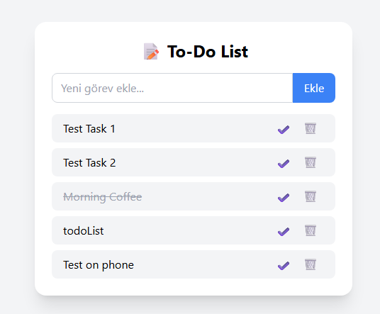

# 📝 Full-Stack ToDo App

Bu proje, HTML, JavaScript, TailwindCSS, Node.js, Express ve MongoDB kullanılarak geliştirilmiş FullStack bir yapılacaklar listesi uygulamasıdır. Kullanıcılar görev ekleyebilir, silebilir ve tamamlandı olarak işaretleyebilir. Veriler MongoDB'de kalıcı olarak saklanır.

## 🚀 Canlı Demo

- 🖥️ Uygulama (Frontend): [https://todo-list-fullstack-delta.vercel.app](https://todo-list-fullstack-delta.vercel.app)
- 📡 API (Backend): [https://todolist-api-wqf8.onrender.com](https://todolist-api-wqf8.onrender.com)

---

## 📷 Ekran Görüntüsü

## 🧰 Kullanılan Teknolojiler

### Frontend:
- HTML5
- TailwindCSS
- Vanilla JavaScript

### Backend:
- Node.js
- Express.js
- MongoDB (Mongoose)
- CORS

## ⚙️ Kurulum ve Çalıştırma (Lokal)

1. Repository'yi klonla

git clone https://github.com/alpsavci/todoList-Fullstack.git
cd todoList-Fullstack

2. Backend'i başlat

cd backend
npm install
npm run dev
MongoDB bağlantı adresini .env dosyasında tanımlayın (veya index.js içine doğrudan yazın).

3. Frontend'i çalıştır

cd ../frontend

index.html dosyasını Live Server ile aç.

📂 API Rotaları
Yöntem	    Rota	        Açıklama
GET	        /tasks	        Tüm görevleri getirir 
POST	    /tasks	        Yeni görev ekler 
DELETE	    /tasks/:id	    Görevi siler 
PATCH	    /tasks/:id	    Görevi tamamlandı işaretler 

👨‍💻 Geliştirici
Alp SAVCI  
[GitHub](https://github.com/alpsavci)